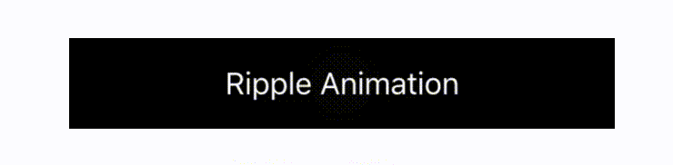

# SYBlinkAnimationKit

[](https://developer.apple.com/iphone/index.action)
[](https://developer.apple.com/swift)
[](http://mit-license.org)

**SYBlinkAnimationKit** is a blink effect animation framework for iOS, written in **Swift**.

## Demo

There are 5 types of Animation for Component.

- Border
<p align="left">

</p>

- BorderWithShadow
<p align="left">

</p>

- Background
<p align="left">

</p>

- Text
<p align="left">

</p>

- Ripple
<p align="left">

</p>

## Features
- Animation like blink effect for UIKit
- The 5 types of Animation : `Border`,  `BorderWithShadow`,  `Background`, `Text`, `Ripple`
- Easily usable
- Customizable in any properties
- Support Swift 2.0

- [x] SYButton : available 5 types of Animation
- [x] SYLabel : available 5 types of Animation
- [x] SYTextField : available `Border`,  `BorderWithShadow`,  `Background`, `Ripple`

***Coming Soon***
- [ ] SYView
- [ ] SYTextView

## Demo App
Open Example/SYBlinkAnimationKit.xcworkspace and run SYBlinkAnimationKit-Example to see a simple demonstration.
To run the example project, run `pod install` from the Example directory first.

## Usage
SYBlinkAnimationKit is designed to be easy to use.
Import SYBlinkAnimationKit in class.
```swift
   import SYBlinkAnimationKit
```

1. Call the SYClass. for example,` SYButton`, `SYLabel`, `SYTextField`, etc.
2. if you use custom animation, call animation method ` startAnimation()` / ` stopAnimation()`

### SYButton
```swift
   let syButton = SYButton(frame: CGRectMake(40, 50, 300, 50))
   syButton.setTitle(“ Border Animation", forState: .Normal)
   syButton.syButtonAnimation = .Border
   self.view.addSubview(syButton)

  //Run Animation
  syButton.startAnimation()
  //End Animation
  syButton.stopAnimation() 
```

if you change font size, name, call font method
```swift
  syButton.systemFontOfSize(22.0)
```
```swift
  syButton.fontNameWithSize("ArialHebew", size: 22.0)
```

### SYLabel
if you set text color, use ` labelTextColor` property
```swift
   let syLabel = SYLabel(frame: CGRectMake(40, 50, 300, 50))
   syLabel.text = "Text Animation"
   syLabel.labelTextColor =  UIColor.darkGrayColor()
   syLabel.syLabelAnimation = .Text
   self.view.addSubview(syLabel)
```

### SYTextField
SYTextField stop animation. when a touch.
But you can control this behavior.
```swift
   syTextField.stopAnimationWithTouch = false
```

## Installation

SYBlinkAnimationKit is available through [CocoaPods](http://cocoapods.org). To install
it, simply add the following line to your Podfile:

```ruby
pod "SYBlinkAnimationKit"
```

## Requirements
- iOS 8.3+
- Xcode 7.2

## Author

Shohei Yokoyama, shohei.yok0602@gmail.com

## License

SYBlinkAnimationKit is available under the MIT license. See the LICENSE file for more info.
