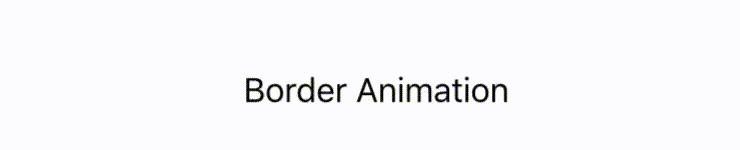
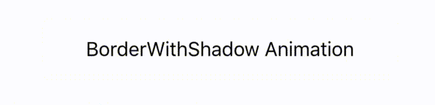
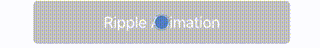
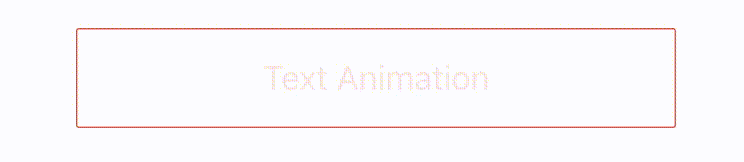
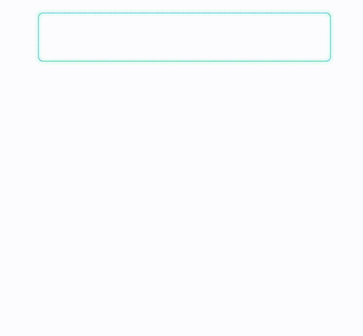

# SYBlinkAnimationKit

[](https://developer.apple.com/iphone/index.action)
[](https://developer.apple.com/swift)
[](http://mit-license.org)

**SYBlinkAnimationKit** is a blink effect animation framework for iOS, written in **Swift**.

## Demo

There are 5 types of animation for component.

**border**
<p align="left">

</p>

**borderWithShadow**
<p align="left">

</p>

**background**
<p align="left">

</p>

**ripple**
<p align="left">

</p>

**text**
<p align="left">

</p>

## Features
- Animation like blink effect for UIKit
- The 5 types of animation : `border`,  `borderWithShadow`,  `background`, `ripple`, `text`
- Easily usable
- Customizable in any properties for animation
- Support Swift 2.0
- Support `@IBDesignable` and `@IBInspectable`.
you can change properties in Interface Builder(IB) inspector. then IB update your custom objects automatically.

- [x] [SYButton](https://github.com/shoheiyokoyama/SYBlinkAnimationKit/blob/master/Source/SYButton.swift) 
- [x] [SYLabel](https://github.com/shoheiyokoyama/SYBlinkAnimationKit/blob/master/Source/SYLabel.swift)
- [x] [SYTextField](https://github.com/shoheiyokoyama/SYBlinkAnimationKit/blob/master/Source/SYTextField.swift) 
- [x] [SYView](https://github.com/shoheiyokoyama/SYBlinkAnimationKit/blob/master/Source/SYView.swift)
- [x] [SYTableViewCell](https://github.com/shoheiyokoyama/SYBlinkAnimationKit/blob/master/Source/SYTableViewCell.swift)

***Coming Soon***
- [ ] SYTextView
- [ ] SYCollectionViewCell
- [ ] SYImageView

## Demo App
Open Example/SYBlinkAnimationKit.xcworkspace and run SYBlinkAnimationKit-Example to see a simple demonstration.

To run the example project, run `pod install` from the Example directory first.

## Usage
First, Import **SYBlinkAnimationKit** in class.
```swift
   import SYBlinkAnimationKit
```

**SYBlinkAnimationKit** is designed to be easy to use.

1. Call the SYClass. for example,` SYButton`, `SYLabel`, `SYTextField`, etc.
2. If you use custom animation, call animation method ` startAnimation()`, ` stopAnimation()`

### [SYButton](https://github.com/shoheiyokoyama/SYBlinkAnimationKit/blob/master/Source/SYButton.swift)
```swift
   let syButton = SYButton(frame: CGRectMake(40, 50, 300, 50))
   syButton.setTitle("Border Animation", forState: .Normal)
   syButton.animationType = .border
   view.addSubview(syButton)

  //Run Animation
  syButton.startAnimation()
  //End Animation
  syButton.stopAnimation() 
```

If you change text font size, name, you are supposed to call the `setFontOfSize()`, `setFontNameWithSize()`
```swift
  syButton.setFontOfSize(22.0)
```
```swift
  syButton.setFontNameWithSize("ArialHebew", size: 22.0)
```

### [SYLabel](https://github.com/shoheiyokoyama/SYBlinkAnimationKit/blob/master/Source/SYLabel.swift)
If you set text color, you are supposed to set the ` labelTextColor` property.
To change text font, use font method as with SYButton.
```swift
   let syLabel = SYLabel(frame: CGRectMake(40, 50, 300, 50))
   syLabel.text = "Text Animation"
   syLabel.labelTextColor =  UIColor.darkGrayColor()
   syLabel.setFontNameWithSize("ArialHebew", size: 22.0)
   syLabel.animationType = .text
   view.addSubview(syLabel)
```

### [SYTextField](https://github.com/shoheiyokoyama/SYBlinkAnimationKit/blob/master/Source/SYTextField.swift)
SYTextField stop animation. when a touch.
but you can control this behavior.
```swift
   //The animation stop. when a touch. default is true
   syTextField.stopAnimationWithTouch = true
```

<p align="center">

</p>

## Customize animation properties

### Animation Type

If you just want to change the types of animation, you can customize `animationType`.

```swift
   // default is border
   var animationType: AnimationType
   
   // Support 5 types of animation
   enum AnimationType: Int {
        case border
        case borderWithShadow
        case background
        case ripple
        case text
    }
```

#### *inspectable*

Set `animationAdapter` (with Integer) in place of `animationType` in IB.

- border: 0
- borderWithShadow: 1
- background: 2
- ripple: 3
- text: 4

### Animation Color

You can customize the properties of the color.
These properties are *inspectable*.

```swift
   var animationBorderColor: UIColor
```
```swift
   var animationBackgroundColor: UIColor
```
```swift
   var animationTextColor: UIColor
```
```swift
   var animationRippleColor: UIColor
```

### Animation Duration, Timing

You can customize `animationTimingFunction`, `animationDuration`.


```swift
   //default is linear
   var animationTimingFunction: SYMediaTimingFunction
   
   enum SYMediaTimingFunction: Int {
        case linear
        case easeIn
        case easeOut
        case easeInEaseOut
   }

```

```swift
   //default is 2.0
   public var animationDuration: CGFloat 
```

#### *inspectable*

Set `animationTimingAdapter` (with Integer) in place of `animationTimingFunction` in IB.

- linear: 0
- easeIn: 1
- easeOut: 2
- easeInEaseOut: 3

### Customize Animatable Text

You can customize Animatable Text alignment.
Support 9 types of alignment.
Available `SYButton`, `SYLabel` now.

````swift
    var textPosition: TextPosition
    
    enum TextPosition {
        case topLeft, topCenter, topRight
        case left, center, right
        case bottomLeft, bottomCenter, bottomRight
    }
````

### Whether animating or not

If SYClass is in middle of animation, this property is `true`
```swift
   public var isAnimating: Bool
```

## Installation

***SYBlinkAnimationKit*** is available through [CocoaPods](http://cocoapods.org). To install
it, simply add the following line to your Podfile:

```ruby
pod "SYBlinkAnimationKit"
```

## Requirements
- iOS 8.3+
- Xcode 7.2

## Author

Shohei Yokoyama, shohei.yok0602@gmail.com

## License

***SYBlinkAnimationKit*** is available under the MIT license. See the [LICENSE file](https://github.com/shoheiyokoyama/SYBlinkAnimationKit/blob/master/LICENSE) for more info.
